# DHL AeroCheck ✈️

**Automated Aircraft Engine Tie-Down & Pneumatic Suspension Inspection System**

A mobile-first, AI-powered Progressive Web App (PWA) built for the DHL Global Forwarding & GE Aerospace Hackathon. 

This platform enables field operators to easily capture tie-down photos of aircraft engines in transit, and uses a multi-modal computer vision pipeline to guarantee safety with a strict conservative-by-design policy (Target: False Positive ≤ 1%).

---

## 📱 App Walkthrough & UI Mocks

Below are the actual screens from our Progressive Web App interface, optimized for mobile field operators and desktop safety reviewers.

### 1. Authentication & Role Selection
Modern glassmorphism UI with role switching between Field Operator and Safety Reviewer.
<p float="left">
  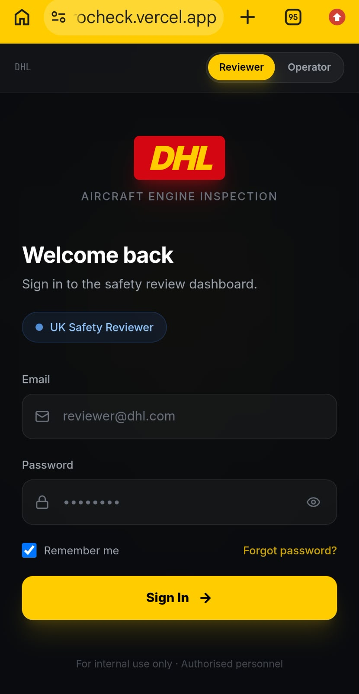
  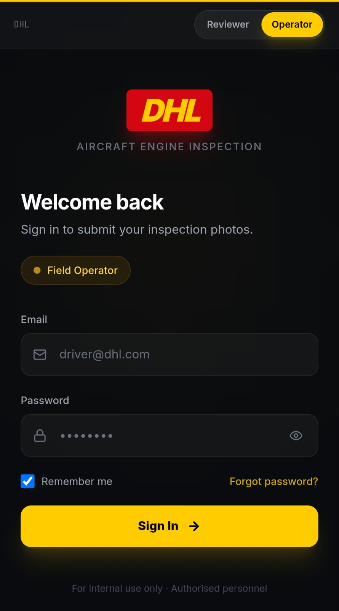
</p>

### 2. Field Operator Dashboard (Mobile PWA)
Streamlined upload process utilizing the native device camera (`capture="environment"`) or gallery uploads, with interactive upload states and clear action buttons.
<p float="left">
  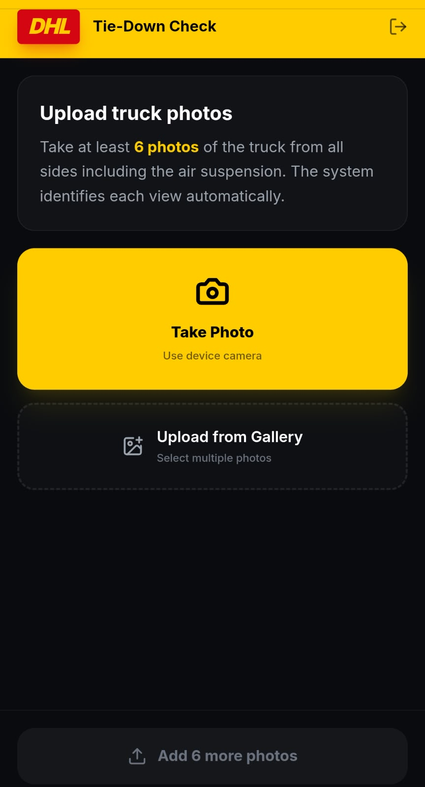
  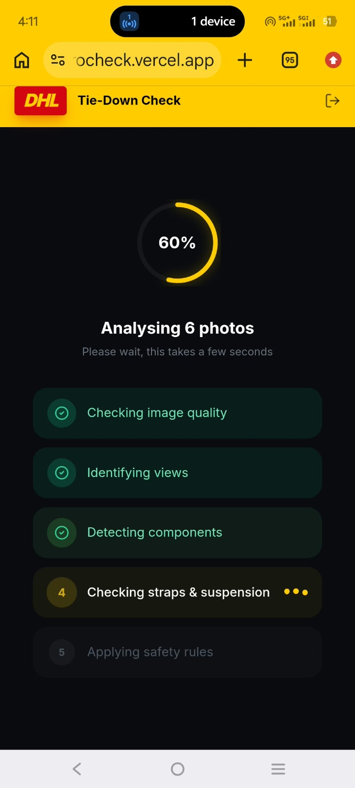
</p>

### 3. Pipeline Processing & Results (Operator View)
Real-time progress indicators as the AI pipeline runs, followed by a clear, unmissable outcome.
<p float="left">
  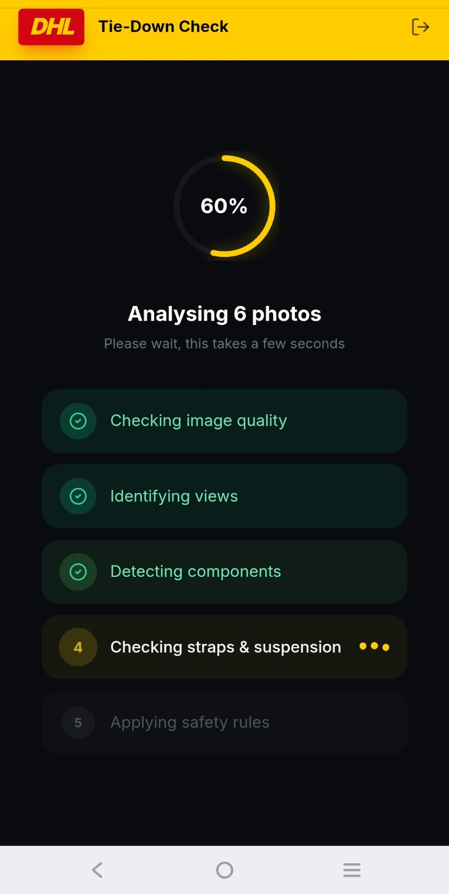
  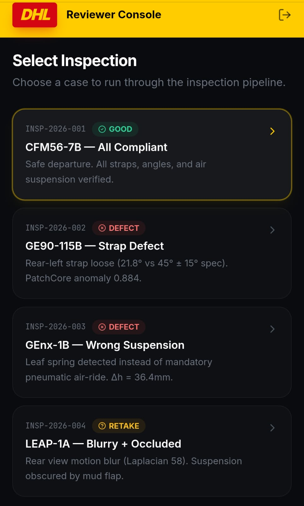
  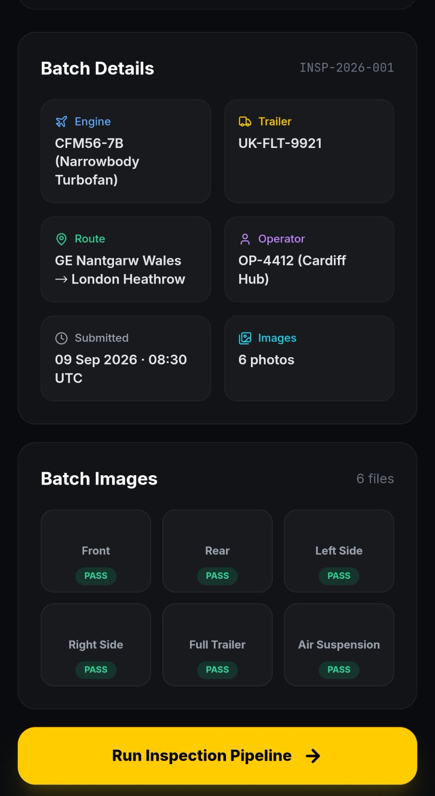
</p>

### 4. UK Safety Reviewer Console (Desktop/Tablet)
Rich dashboard displaying metadata, batch image analysis, and the chronological execution of the computer vision models (DINOv2, SAM 2, PatchCore).
<p float="left">
  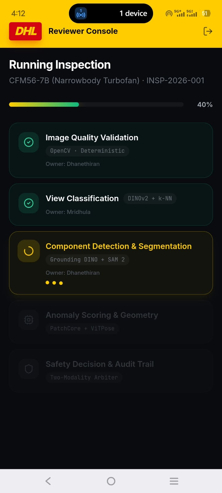
  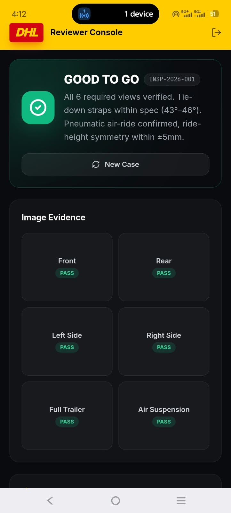
</p>

### 5. Evidence & Two-Modality Arbiter
The core safety layer. A component is only marked as `BAD` if **both** the Anomaly model (PatchCore) and Geometric model (ViTPose) agree. This eliminates false positives.
<p float="left">
  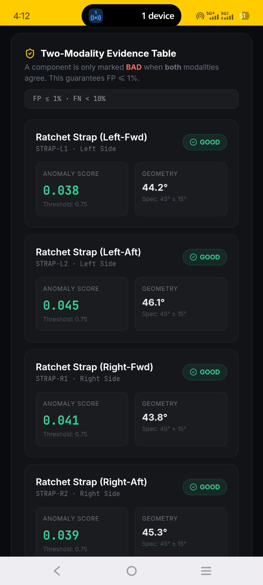
  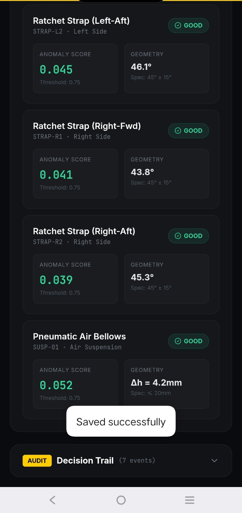
</p>

---

## 🛠️ Tech Stack
* **Frontend:** React 18, Vite, Tailwind CSS, Lucide Icons
* **PWA:** Offline-ready Service Worker, Web App Manifest
* **CV Pipeline (Backend APIs pending):** OpenCV, DINOv2 (Classification), Grounding DINO + SAM 2 (Segmentation), PatchCore (Anomaly), ViTPose (Geometry).

## 🚀 Quick Start
```bash
npm install
npm run dev
```
Access at `http://localhost:5173`. To view the mobile PWA experience, use Chrome DevTools (F12) and toggle the Device Toolbar.

*Designed for the 2026 GE Aerospace & DHL Hackathon.*
